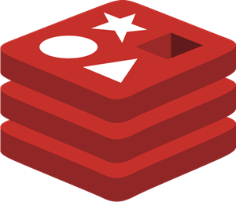

# <h1 align="center">Redis Playground </h1>

<p align="center">
  
  
  
</p>

<p align="center">
This repository is a comprehensive exploration of Redis, focusing on understanding various Redis data types and operations using Node.js with the ioredis package. The code has been adapted and enhanced from the official Redis documentation for better clarity and error resolution.
</p>

## 🚀 Features

- **Data Types Covered:**
  - Strings
  - JSON
  - Lists
  - Sets
  - Hashes
  - Sorted Sets
  - Streams
  - Geospatial
  - Bitmaps
  - Bitfields
  - Probabilistic Data Structures
  - Time Series
- **Improved Code:** The examples provided have been extensively commented and modified for better understanding and error handling.

## 🏁 Getting Started

### Prerequisites

- **Node.js** installed on your system.
- **Docker** installed to run the Redis server.

### Installation

1. **Clone the repository:**
   ```bash
   git clone https://github.com/your-username/redis-playground.git
   cd redis-playground
   ```

2. **Set up Redis server using Docker:**
   ```bash
   docker pull redis/redis-stack-server:latest
   docker run -d --name redis-stack-server -p 6379:6379 redis/redis-stack-server:latest
   ```

3. **Verify the installation:**
   ```bash
   docker ps
   ```
   - The above command should list the running Docker containers. If Redis is running, you should see it listed here.
   - Port `6379` is used for Redis operations, and port `8001` is used for the Redis GUI.

4. **Access Redis CLI (optional):**
   ```bash
   docker exec -it redis-stack-server bash
   redis-cli ping
   ```
   - If you receive `PONG`, Redis is running correctly.

### Running the Code

To run the examples, make sure the Redis server is up and running, then execute the desired file using Node.js:

```bash
node file_name.js
```

Replace `file_name.js` with the name of the file you wish to execute.

---

<p align="center">
For more information, you can refer to the <a href="https://redis.io/docs/latest/develop/data-types/">official Redis documentation</a>.
</p>